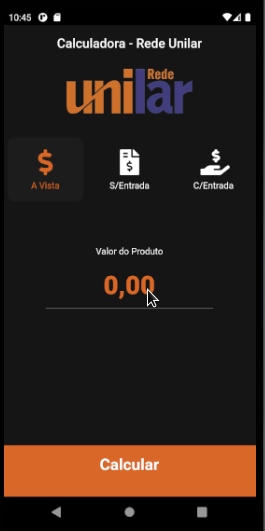

  

<h3 align="center">
    Calculadora HS - Rede Unilar
</h3>

  

  

### ✌ Olá!

Este aplicativo tem como objetivo auxilia os vendedores da loja HS a realizarem os seus cálculos, automatizando o processo.

### 💻 Utilização

 

  

